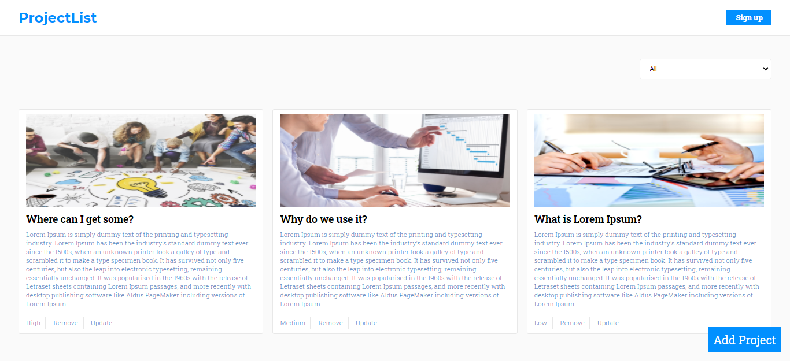

# ProjectList

- This is simple CRUD React & Redux application.You can create,update,delete your projects and also filter them by their priority.

### Main page

## Live Demo

- [Live](https://crud-projects.netlify.app/)

## Main Features

- Create,Update and Delete a project.
- Details page about the project info.

## Built with

- TypeScript
- React
- Redux
- SCSS
- Jest

## Getting Started

- Run `yarn install` or `npm install` to install dependencies
- On the terminal run `npm run start` open up the live server
- To run tests write `npm run test` or `yarn test` on the terminal

